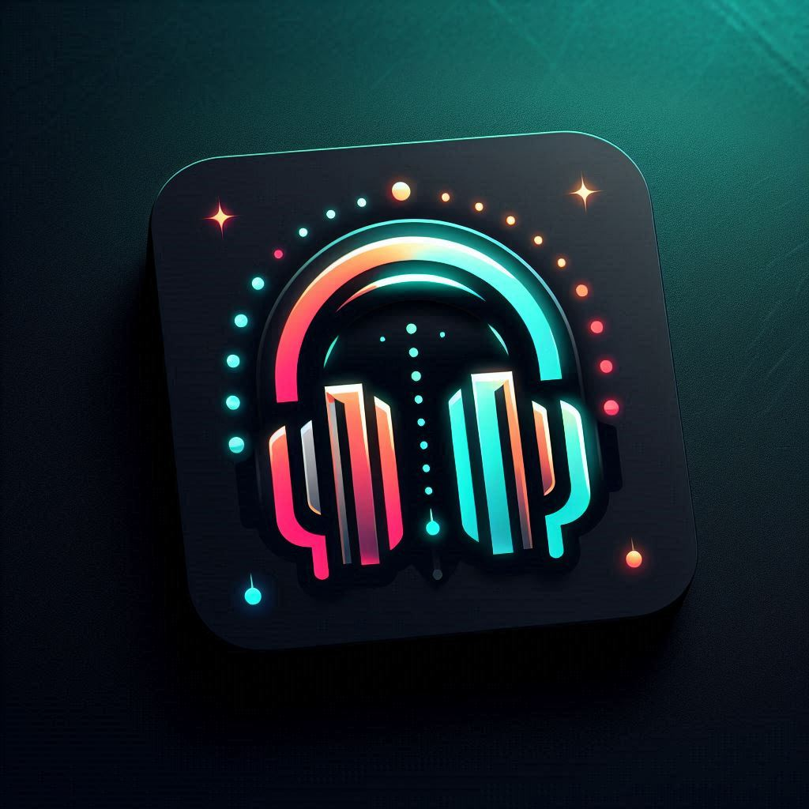

  

  # MusicVibe
  **Your Ultimate Social Soundtrack**

  
  
  

   

  ## 👉 [Add MusicVibe to your Discord Server](https://discord.com/oauth2/authorize?client_id=1471780817658318848&permissions=3165184&integration_type=0&scope=bot+applications.commands) 👈

---

## 🎵 About MusicVibe
Take your voice channels to a whole new level with **MusicVibe**. Designed for perfect synchronization, it allows you and your friends to enjoy your favorite music together in real-time. 

> No need to wait for everyone to press "play." Just enjoy the best audio experience for your entire community.

## ✨ Core Features

| Feature | Description |
| :--- | :--- |
| 🎧 **Shared Listening** | Synchronize your music experience with everyone in your voice call. |
| 🎼 **Collaborative Queue** | Everyone gets a turn to add their favorite tunes to the playlist. |
| 🔊 **High-Fidelity Audio** | Savor the best audio experience, optimized for Discord. |
| 🎛️ **Intuitive Controls** | Simple and easy-to-remember Slash Commands (`/`). |

## 🚀 Command List 

MusicVibe uses modern **Slash Commands** for a seamless experience.

| Command | Description |
| :--- | :--- |
| `/join` | 🟢 Invite MusicVibe to join your voice channel. |
| `/play [song]` | ▶️ Play your favorite tune from YouTube. |
| `/nowplaying`| 📝 Shows detailed information (Title, Duration, Thumbnail) of the song currently playing.
| `/next`| ⏭️ Skips the current song and starts playing the next one in the queue.
| `/queue`| 📋 Displays the list of upcoming songs waiting to be played.
| `/pause` | ⏸️ Pause the music when you need a break. |
| `/resume` | ⏯️ Resume playing from where you left off. |
| `/stop` | ⏹️ Stop the music completely. |
| `/leave` | 👋 Disconnect MusicVibe safely from the call. |

## 🛠️ Support & Information
|  `/commands`| 📖 Opens the interactive command guide and help menu.
|  `/invite`| ✉️ Generates an official invite link to add MusicVibe to your own servers.

## 📜 Legal & Privacy

We value your privacy and transparency.
* [Terms of Service](./TOS.md)
* [Privacy Policy](./PRIVACY.md)

---

  Created with ❤️ by Vasilhsv

